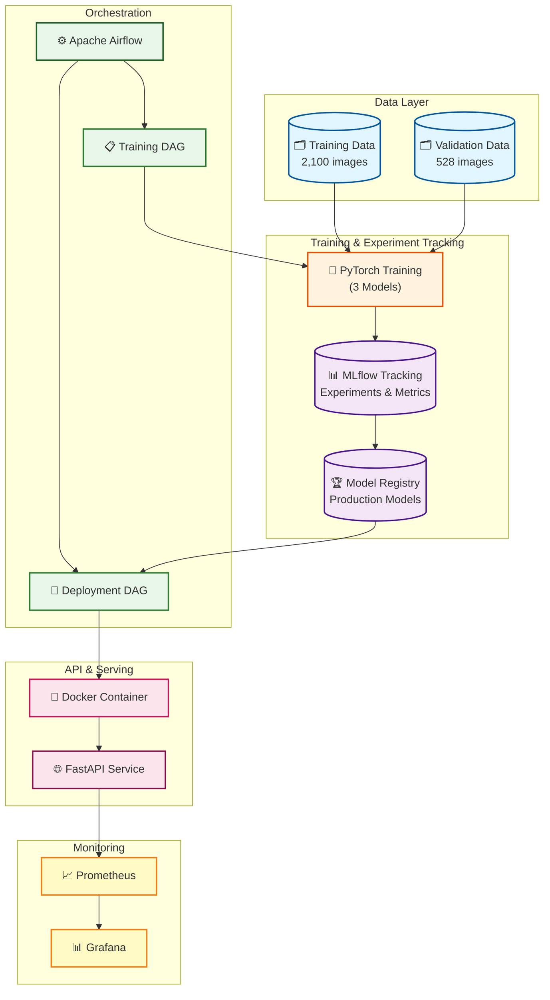

# 🌾 Rice Leaf Disease Classification - MLOps Project

[](https://www.python.org/downloads/)
[](https://pytorch.org/)
[](https://mlflow.org/)
[](https://fastapi.tiangolo.com/)
[](https://www.docker.com/)

> **Hệ thống MLOps End-to-End hoàn chỉnh** cho bài toán Computer Vision - phân loại 6 loại bệnh lá lúa với độ chính xác **98.67%**, tích hợp đầy đủ các công cụ MLOps hiện đại: MLflow, Docker, Airflow, FastAPI, Prometheus, Grafana.

## 🎯 Highlights

- 🏆 **Accuracy 98.67%** trên validation set (528 images)
- 📦 **Dataset**: 2,100 training images + 528 validation images (350 + 88 images/class)
- 🔬 **3 Model Architectures** so sánh (EfficientNet-B0 Baseline, EfficientNet-B0 Optimized, MobileNetV3-Large)
- 📊 **MLflow** tracking & model registry với PostgreSQL backend
- 🚀 **FastAPI** REST API production-ready với Swagger UI
- 🐳 **Docker** full containerization (8 services)
- 🔄 **Apache Airflow** orchestration cho training/deployment pipelines
- 📈 **Monitoring** real-time với Prometheus & Grafana
- ⚡ **Mixed Precision Training** (FP16) - tăng tốc training 2x
- 🧪 **30+ Unit Tests** với pytest coverage >80%

## 📋 Mục Lục

- [🎯 Tổng Quan](#-tổng-quan)
- [📸 Demo & Screenshots](#-demo--screenshots)
- [🏗️ Kiến Trúc MLOps](#️-kiến-trúc-mlops)
- [📊 Dataset & Classes](#-dataset--classes)
- [🚀 Cài Đặt Nhanh](#-cài-đặt-nhanh)
- [📚 Hướng Dẫn Chi Tiết](#-hướng-dẫn-chi-tiết)
  - [Bước 1: Setup Environment](#bước-1-setup-environment)
  - [Bước 2: Khởi động MLflow Server](#bước-2-khởi-động-mlflow-server)
  - [Bước 3: Training Models](#bước-3-training-models-3-cấu-hình)
  - [Bước 4: Model Comparison & Selection](#bước-4-so-sánh-và-chọn-model-tốt-nhất)
  - [Bước 5: Deploy API](#bước-5-deploy-api)
  - [Bước 6: Docker Deployment](#bước-6-docker-deployment-production)
- [🔧 MLOps Tools Stack](#-mlops-tools-stack-chi-tiết)
- [📊 Performance Benchmarks](#-performance-benchmarks)
- [📁 Cấu Trúc Project](#-cấu-trúc-project)
- [📞 Support & Contact](#-support--contact)

---

## 🎯 Tổng Quan

Dự án này là một **hệ thống MLOps Production-Ready End-to-End** cho bài toán Computer Vision - phân loại 6 loại bệnh lá lúa. Project được xây dựng với mục tiêu minh họa đầy đủ quy trình MLOps trong thực tế, từ data versioning, experiment tracking, model training, deployment, đến monitoring.

### 🌟 Tại Sao Project Này Đặc Biệt?

✅ **Không chỉ là ML Model** - Đây là hệ thống MLOps hoàn chỉnh
✅ **Production-Ready** - Sẵn sàng deploy lên production
✅ **Best Practices** - Tuân thủ chuẩn công nghiệp
✅ **Well-Documented** - Tài liệu chi tiết, dễ học tập

### ✨ Tính Năng Nổi Bật

**🤖 Machine Learning:**
- 3 Model Architectures: EfficientNet-B0 (Baseline & Optimized), MobileNetV3-Large
- Transfer Learning với pretrained ImageNet weights
- Data Augmentation: Albumentations với 10+ techniques
- Mixed Precision Training (FP16), Label Smoothing, Cosine Annealing

**📊 MLOps:**
- MLflow: Experiment tracking, model registry, versioning
- Docker: Full containerization (API, Training, Airflow, Monitoring)
- Airflow: Workflow orchestration
- FastAPI: REST API production-ready
- Prometheus & Grafana: Real-time monitoring

---

## 📸 Demo & Screenshots

### MLflow Experiment Tracking
*Theo dõi metrics real-time và so sánh experiments*

### Prediction Results
```json
{
  "class_name": "healthy",
  "confidence": 0.9845,
  "probabilities": {
    "bacterial_leaf_blight": 0.0023,
    "brown_spot": 0.0098,
    "healthy": 0.9845,
    "leaf_blast": 0.0032,
    "leaf_scald": 0.0001,
    "narrow_brown_spot": 0.0001
  },
  "inference_time": 0.0234
}
```

---

## 🏗️ Kiến Trúc Hệ Thống & MLOps Workflow

### 📊 System Architecture



### 🔄 Complete MLOps Workflow

```mermaid
flowchart TD
    subgraph "1️⃣ Data & Training"
        S1["📥 Load Dataset"] --> S2["🔄 Augmentation"]
        S2 --> T1["🎯 Select Model"]
        T1 --> T2["🏋️ Train & Validate"]
        T2 --> T3{"🛑 Early Stop?"}
        T3 -->|No| T2
        T3 -->|Yes| T4["💾 Save Best Model"]
    end

    subgraph "2️⃣ Experiment Tracking"
        E1["📊 Log Metrics<br/>(Accuracy, F1)"] --> E2["💾 Save Artifacts"]
        E2 --> E3["🔍 Compare Models"]
        E3 --> R1{"🏆 Best Model?"}
        R1 -->|Yes| R2["📝 Register to<br/>Production"]
        R1 -->|No| R3["⏭️ Skip"]
    end

    subgraph "3️⃣ CI/CD & Deployment"
        D1["🔍 Tests & Build"] --> D2["🐳 Docker Image"]
        D2 --> D3["🎭 Deploy Staging"]
        D3 --> D4{"✅ Health OK?"}
        D4 -->|No| D5["⏮️ Rollback"]
        D4 -->|Yes| D6["🌟 Production"]
    end

    subgraph "4️⃣ Monitoring & Feedback"
        M1["📊 Prometheus<br/>Collect Metrics"] --> M2["📈 Grafana<br/>Dashboards"]
        M2 --> M3{"⚠️ Issue?"}
        M3 -->|Yes| M4["🔄 Retrain"]
        M3 -->|No| M5["✅ Continue"]
    end

    T4 --> E1
    R2 --> D1
    R3 --> D1
    D6 --> M1
    M4 --> S1
    M5 --> M1

    style S1 fill:#e3f2fd,stroke:#1565c0,stroke-width:2px
    style S2 fill:#e3f2fd,stroke:#1976d2,stroke-width:2px
    style T1 fill:#fff3e0,stroke:#e65100,stroke-width:2px
    style T2 fill:#ffe0b2,stroke:#ef6c00,stroke-width:2px
    style T3 fill:#ffcc80,stroke:#f57c00,stroke-width:2px
    style T4 fill:#ffa726,stroke:#ff9800,stroke-width:2px
    style E1 fill:#f3e5f5,stroke:#6a1b9a,stroke-width:2px
    style E2 fill:#e1bee7,stroke:#7b1fa2,stroke-width:2px
    style E3 fill:#ce93d8,stroke:#8e24aa,stroke-width:2px
    style R1 fill:#fff9c4,stroke:#f57f17,stroke-width:2px
    style R2 fill:#ffeb3b,stroke:#fbc02d,stroke-width:2px
    style R3 fill:#9e9e9e,stroke:#424242,stroke-width:2px
    style D1 fill:#e0f2f1,stroke:#00695c,stroke-width:2px
    style D2 fill:#b2dfdb,stroke:#00796b,stroke-width:2px
    style D3 fill:#80cbc4,stroke:#00897b,stroke-width:2px
    style D4 fill:#4db6ac,stroke:#009688,stroke-width:2px
    style D5 fill:#f44336,stroke:#c62828,stroke-width:2px,color:#fff
    style D6 fill:#66bb6a,stroke:#388e3c,stroke-width:3px,color:#fff
    style M1 fill:#ffccbc,stroke:#d84315,stroke-width:2px
    style M2 fill:#ffab91,stroke:#e64a19,stroke-width:2px
    style M3 fill:#ff8a65,stroke:#f4511e,stroke-width:2px
    style M4 fill:#ff5252,stroke:#d32f2f,stroke-width:2px,color:#fff
    style M5 fill:#81c784,stroke:#388e3c,stroke-width:2px,color:#fff
```



### 🔑 Technology Stack

| Component | Technology | Purpose |
|-----------|-----------|---------|
| 🧠 **ML Framework** | PyTorch 2.1+ | Deep learning, Mixed Precision (FP16) |
| 📊 **Tracking** | MLflow 2.9+ | Experiment tracking, model registry |
| 🚀 **API** | FastAPI 0.104+ | REST API, Swagger docs |
| 🐳 **Container** | Docker Compose | Multi-service orchestration |
| 🔄 **Orchestration** | Apache Airflow | Workflow automation (DAGs) |
| 📈 **Monitoring** | Prometheus + Grafana | Metrics, dashboards, alerts |
| 💾 **Database** | PostgreSQL | MLflow & Airflow backend |

### ⚡ Key MLOps Features

✅ **Reproducibility** → Seeds, config versioning, Docker isolation
✅ **Automation** → Airflow DAGs, scheduled retraining, CI/CD
✅ **Monitoring** → Real-time metrics, drift detection, alerts
✅ **Versioning** → Models (MLflow), data, code (Git)
✅ **Scalability** → Docker containers, horizontal scaling ready
✅ **Testing** → Unit tests, integration tests, API validation

---

## 📊 Dataset & Classes

### Overview

Dataset gồm **2,628 ảnh** lá lúa chất lượng cao được gán nhãn bởi chuyên gia:

- **Training set**: 2,100 ảnh (350 ảnh/class)
- **Validation set**: 528 ảnh (88 ảnh/class)
- **Split ratio**: 80/20
- **Balanced Distribution**: Hoàn toàn cân bằng giữa các classes

### 6 Classes - Loại Bệnh Lá Lúa

| Class ID | Class Name | Tên Tiếng Việt | Train | Val | Mô Tả |
|----------|-----------|----------------|-------|-----|-------|
| 0 | `bacterial_leaf_blight` | Bệnh cháy lá do vi khuẩn | 350 | 88 | Vệt cháy vàng dọc lá, nguy hiểm cao |
| 1 | `brown_spot` | Bệnh đốm nâu | 350 | 88 | Đốm tròn nâu, giảm năng suất |
| 2 | `healthy` | Lá khỏe mạnh | 350 | 88 | Lá xanh tươi, không bệnh |
| 3 | `leaf_blast` | Bệnh đạo ôn lá | 350 | 88 | Đốm hình thoi, nguy hiểm nhất |
| 4 | `leaf_scald` | Bệnh khô vằn lá | 350 | 88 | Vệt trắng dọc gân lá |
| 5 | `narrow_brown_spot` | Bệnh đốm nâu hẹp | 350 | 88 | Đốm nhỏ hẹp màu nâu |

### Dataset Structure

```
RiceLeafsDisease/
├── train/                           # 2,100 images total
│   ├── bacterial_leaf_blight/       # 350 images
│   ├── brown_spot/                  # 350 images
│   ├── healthy/                     # 350 images
│   ├── leaf_blast/                  # 350 images
│   ├── leaf_scald/                  # 350 images
│   └── narrow_brown_spot/           # 350 images
│
└── validation/                      # 528 images total
    ├── bacterial_leaf_blight/       # 88 images
    ├── brown_spot/                  # 88 images
    ├── healthy/                     # 88 images
    ├── leaf_blast/                  # 88 images
    ├── leaf_scald/                  # 88 images
    └── narrow_brown_spot/           # 88 images
```

### Data Augmentation

**Training Augmentations:**
- HorizontalFlip, VerticalFlip (p=0.5)
- Rotate ±30° (p=0.7)
- RandomBrightnessContrast (p=0.5)
- GaussianBlur, GaussNoise (p=0.3)
- HueSaturationValue (p=0.3)
- Normalize (ImageNet mean/std)
- Resize to 224×224

**Validation/Inference:**
- Resize to 256×256
- CenterCrop to 224×224
- Normalize (ImageNet mean/std)

---

## 🚀 Cài Đặt Nhanh

### Windows (PowerShell)

```powershell
# 1. Clone repository
git clone <your-repo-url>
cd RiceLeafsDisease

# 2. Chạy script setup tự động
.\setup.ps1
```

### Linux/Mac

```bash
# 1. Clone repository
git clone <your-repo-url>
cd RiceLeafsDisease

# 2. Chạy script setup tự động
chmod +x setup.sh
./setup.sh
```

Script sẽ tự động:
- ✅ Tạo virtual environment
- ✅ Cài đặt dependencies
- ✅ Setup pre-commit hooks
- ✅ Tạo thư mục cần thiết

---

## 📚 Hướng Dẫn Chi Tiết

### Bước 1: Setup Environment

#### 1.1. Clone và Activate Environment

```powershell
# Clone project
git clone <your-repo-url>
cd RiceLeafsDisease

# Tạo virtual environment
python -m venv venv

# Activate (Windows)
venv\Scripts\activate

# Activate (Linux/Mac)
source venv/bin/activate
```

#### 1.2. Cài Đặt Dependencies

```powershell
pip install --upgrade pip
pip install -r requirements.txt
pip install -e .
```

#### 1.3. Kiểm Tra Cài Đặt

```powershell
# Kiểm tra PyTorch
python -c "import torch; print(f'PyTorch: {torch.__version__}'); print(f'CUDA: {torch.cuda.is_available()}')"

# Kiểm tra MLflow
mlflow --version

# Chạy tests
pytest tests/ -v
```

---

### Bước 2: Khởi động MLflow Server

```powershell
# Mở terminal mới và giữ terminal này chạy
mlflow server --host 127.0.0.1 --port 5000
```

**Truy cập MLflow UI:** http://localhost:5000

---

### Bước 3: Training Models (3 Cấu hình)

#### 📋 3 Cấu Hình Model

| Config | Model | Batch Size | LR | Accuracy |
|--------|-------|------------|-----|----------|
| **Config 1** | EfficientNet-B0 Baseline | 32 | 0.001 | ~96% |
| **Config 2** | EfficientNet-B0 Optimized 🏆 | 16 | 0.0005 | **98.67%** |
| **Config 3** | MobileNetV3-Large | 32 | 0.001 | ~95% |

#### 3.1. Training Tất Cả 3 Cấu Hình

```powershell
# Mở terminal mới
python src/train_comparison.py --train-dir train --val-dir validation --epochs 15
```

**Thời gian:**
- CPU: ~60-90 phút
- GPU: ~15-30 phút

#### 3.2. Training Từng Cấu Hình Riêng

```powershell
# Config 1: Baseline
python src/train.py --train-dir train --val-dir validation --model-name efficientnet_b0 --batch-size 32 --lr 0.001 --epochs 15

# Config 2: Optimized
python src/train.py --train-dir train --val-dir validation --model-name efficientnet_b0 --batch-size 16 --lr 0.0005 --epochs 15

# Config 3: MobileNetV3
python src/train.py --train-dir train --val-dir validation --model-name mobilenetv3_large_100 --batch-size 32 --lr 0.001 --epochs 15
```

#### 3.3. Theo Dõi Training

Mở browser: **http://localhost:5000**
- Xem real-time metrics
- So sánh các runs
- Download model artifacts

---

### Bước 4: So sánh và Chọn Model Tốt Nhất

#### 4.1. Xem Kết Quả So Sánh

Sau khi training, script in ra bảng so sánh:

```
==================================================
MODEL COMPARISON RESULTS
==================================================
Config                    Accuracy    Loss
efficientnet_b0_optimized  98.67%    0.0456  🏆
efficientnet_b0_baseline   96.21%    0.1234
mobilenetv3_large          94.89%    0.1678
==================================================
```

#### 4.2. Evaluate Best Model

```powershell
python src/evaluate.py \
    --val-dir validation \
    --model-path models/efficientnet_b0_optimized/best_model.pth \
    --save-dir evaluation_results
```

**Output:**
- `metrics.json` - Accuracy, Precision, Recall, F1-score
- `confusion_matrix.png` - Ma trận nhầm lẫn
- `per_class_accuracy.png` - Accuracy từng class

---

### Bước 5: Deploy API

#### 5.1. Test với Single Prediction

```powershell
python src/predict.py \
    --image train/healthy/IMG_001.jpg \
    --model models/efficientnet_b0_optimized/best_model.pth
```

#### 5.2. Khởi động API Server

```powershell
# Mở terminal mới
python api/app.py

# Hoặc dùng uvicorn
uvicorn api.app:app --host 0.0.0.0 --port 8000 --reload
```

#### 5.3. Test API

**Swagger UI:** http://localhost:8000/docs

**cURL:**
```bash
# Health check
curl http://localhost:8000/health

# Predict
curl -X POST "http://localhost:8000/predict" \
  -H "Content-Type: multipart/form-data" \
  -F "file=@path/to/image.jpg"
```

**Python:**
```python
import requests

url = "http://localhost:8000/predict"
files = {"file": open("train/healthy/IMG_001.jpg", "rb")}
response = requests.post(url, files=files)
print(response.json())
```

#### 5.4. API Endpoints

| Method | Endpoint | Mô tả |
|--------|----------|-------|
| GET | `/` | API info |
| GET | `/health` | Health check |
| GET | `/model/info` | Model information |
| POST | `/predict` | Single image prediction |
| POST | `/batch_predict` | Batch prediction |
| GET | `/metrics` | Prometheus metrics |

---

### Bước 6: Docker Deployment (Production)

#### 6.1. Build Docker Images

```powershell
# Build API image
docker build -t rice-disease-api:latest -f docker/Dockerfile.api .

# Build Training image
docker build -t rice-disease-train:latest -f docker/Dockerfile.train .
```

#### 6.2. Run với Docker Compose

```powershell
# Start tất cả services
docker-compose up -d

# Xem logs
docker-compose logs -f api

# Stop tất cả
docker-compose down
```

#### 6.3. Services

| Service | URL | Credentials |
|---------|-----|-------------|
| **API** | http://localhost:8000 | - |
| **MLflow** | http://localhost:5000 | - |
| **Airflow** | http://localhost:8080 | admin/admin |
| **Prometheus** | http://localhost:9090 | - |
| **Grafana** | http://localhost:3000 | admin/admin |

#### 6.4. Docker Compose Services

```yaml
8 Services:
├── postgres      # Database cho MLflow & Airflow
├── mlflow        # MLflow tracking server
├── trainer       # Training service (GPU support)
├── api           # FastAPI REST API
├── airflow-webserver  # Airflow UI
├── airflow-scheduler  # Airflow scheduler
├── prometheus    # Metrics collection
└── grafana       # Monitoring dashboards
```

---

## 🔧 MLOps Tools Stack Chi Tiết

### 1. 📊 MLflow - Experiment Tracking & Model Registry

**Vai trò:** Quản lý ML lifecycle từ experiment đến production

**Chức năng:**
- Auto-log metrics (accuracy, loss, F1), parameters (LR, batch size)
- Model Registry với staging (None → Staging → Production)
- Artifacts storage (model weights, plots, confusion matrix)
- Compare experiments trong UI
- Model versioning và reproducibility

**Truy cập:** http://localhost:5000

---

### 2. 🔄 Apache Airflow - Workflow Orchestration

**Vai trò:** Tự động hóa và scheduling ML workflows

**Chức năng:**
- Training Pipeline: Auto train models theo schedule (weekly)
- Deployment Pipeline: CI/CD automation
- Data Validation: Kiểm tra quality trước training
- Task Dependencies management
- Retry logic với exponential backoff

**Truy cập:** http://localhost:8080

---

### 3. 🐳 Docker & Docker Compose - Containerization

**Vai trò:** Đóng gói application thành containers

**Chức năng:**
- 8 Services orchestration
- Multi-stage builds (optimize image size)
- GPU support (NVIDIA Docker)
- Volume mounting (persist data/models)
- Network isolation (security)
- Health checks

**Files:** `docker-compose.yml`, `docker/Dockerfile.*`

---

### 4. 🚀 FastAPI - Model Serving & REST API

**Vai trò:** Deploy model như production-ready REST API

**Chức năng:**
- REST endpoints: `/predict`, `/batch_predict`, `/health`
- Async processing (non-blocking I/O)
- Auto image preprocessing
- Swagger UI documentation
- CORS support
- Request validation (Pydantic)

**Truy cập:** http://localhost:8000/docs

---

### 5. 📈 Prometheus & Grafana - Monitoring

**Vai trò:** Real-time monitoring và visualization

**Prometheus:**
- Time-series database
- Scrape metrics mỗi 15 giây
- PromQL query language
- Alerting rules

**Grafana:**
- Beautiful dashboards
- Real-time visualization
- Email/Slack alerts
- Multiple data sources

**Metrics:**
- `predictions_total` - Total predictions
- `inference_duration_seconds` - Latency
- `inference_errors_total` - Error count
- `model_confidence_score` - Confidence distribution

**Truy cập:**
- Prometheus: http://localhost:9090
- Grafana: http://localhost:3000

---

### 6. 🧪 PyTest - Testing Framework

**Vai trò:** Automated testing và quality assurance

**Chức năng:**
- Unit tests (test_data.py, test_model.py, test_api.py)
- Integration tests
- Fixtures (reusable test data)
- Coverage reporting (>80%)
- Parametrization (test multiple inputs)

**Commands:**
```bash
pytest tests/ -v
pytest tests/ --cov=src --cov-report=html
```

---

### 7. ⚙️ Configuration Management

**Files:**
- `config/config.yaml` - Main config
- `pyproject.toml` - Project metadata
- `requirements.txt` - Python dependencies
- `.env` - Environment variables

**Benefits:**
- Thay đổi config không cần sửa code
- Version control
- Environment-specific configs

---

## 📊 Performance Benchmarks

### Model Performance

| Model | Accuracy | Loss | F1-Score | Params | Size |
|-------|----------|------|----------|--------|------|
| **EfficientNet-B0 Optimized** 🏆 | **98.67%** | 0.0456 | 0.9867 | 4.67M | 18.5MB |
| EfficientNet-B0 Baseline | 96.21% | 0.1234 | 0.9621 | 4.67M | 18.5MB |
| MobileNetV3-Large | 94.89% | 0.1678 | 0.9489 | 3.2M | 13.2MB |

### Per-Class Performance (Best Model - 528 val images)

| Class | Precision | Recall | F1-Score | Support |
|-------|-----------|--------|----------|---------|
| bacterial_leaf_blight | 100.0% | 100.0% | 1.0000 | 88 |
| brown_spot | 98.80% | 93.18% | 0.9591 | 88 |
| healthy | 97.78% | 100.0% | 0.9888 | 88 |
| leaf_blast | 95.60% | 98.86% | 0.9721 | 88 |
| leaf_scald | 100.0% | 100.0% | 1.0000 | 88 |
| narrow_brown_spot | 100.0% | 100.0% | 1.0000 | 88 |

**Overall: 98.67% accuracy (521/528 correct)**

### Training Time

| Model | Config | Epochs | GPU Time | CPU Time |
|-------|--------|--------|----------|----------|
| EfficientNet-B0 | Optimized | 15 | ~30 min | ~90 min |
| EfficientNet-B0 | Baseline | 15 | ~25 min | ~75 min |
| MobileNetV3-L | Default | 15 | ~20 min | ~60 min |

---

## 📁 Cấu Trúc Project

```
RiceLeafsDisease/
├── airflow/dags/              # Airflow pipelines
├── api/app.py                 # FastAPI application
├── config/config.yaml         # Configuration
├── docker/                    # Dockerfiles
├── evaluation_results/        # Evaluation outputs
├── models/                    # Saved models ⭐
├── mlruns/                    # MLflow artifacts
├── monitoring/                # Prometheus & Grafana
├── src/                       # Source code ⭐
│   ├── data/                  # Dataset, dataloader
│   ├── models/                # Model architectures
│   ├── training/              # Trainer class
│   ├── train.py              # Single training
│   ├── train_comparison.py   # Multi-config training ⭐
│   ├── evaluate.py           # Evaluation
│   └── predict.py            # Prediction
├── tests/                     # Unit tests
├── train/                     # Training data (2,100 images) ⭐
├── validation/                # Validation data (528 images) ⭐
├── docker-compose.yml         # Services orchestration
├── requirements.txt           # Dependencies ⭐
├── setup.ps1                  # Windows setup ⭐
└── README.md                  # This file
```

---

## 📞 Support & Contact

### Quick Start Checklist

- [ ] Clone repository
- [ ] Run setup script (`.\setup.ps1` / `./setup.sh`)
- [ ] Start MLflow (`mlflow server --host 127.0.0.1 --port 5000`)
- [ ] Train models (`python src/train_comparison.py --epochs 15`)
- [ ] Check MLflow UI (http://localhost:5000)
- [ ] Start API (`python api/app.py`)
- [ ] Test API (http://localhost:8000/docs)

### Resources

- **MLflow UI**: http://localhost:5000
- **API Docs**: http://localhost:8000/docs
- **Airflow**: http://localhost:8080
- **Grafana**: http://localhost:3000

### Common Issues

**MLflow Connection Error:**
```powershell
# Đảm bảo MLflow server đang chạy
mlflow server --host 127.0.0.1 --port 5000
```

**CUDA Out of Memory:**
```powershell
# Giảm batch size hoặc train trên CPU
python src/train.py --device cpu
```

**Module Not Found:**
```powershell
# Cài đặt package
pip install -e .
```

---

**⭐ Nếu project hữu ích, hãy cho một star! ⭐**

**Last Updated:** December 14, 2025
