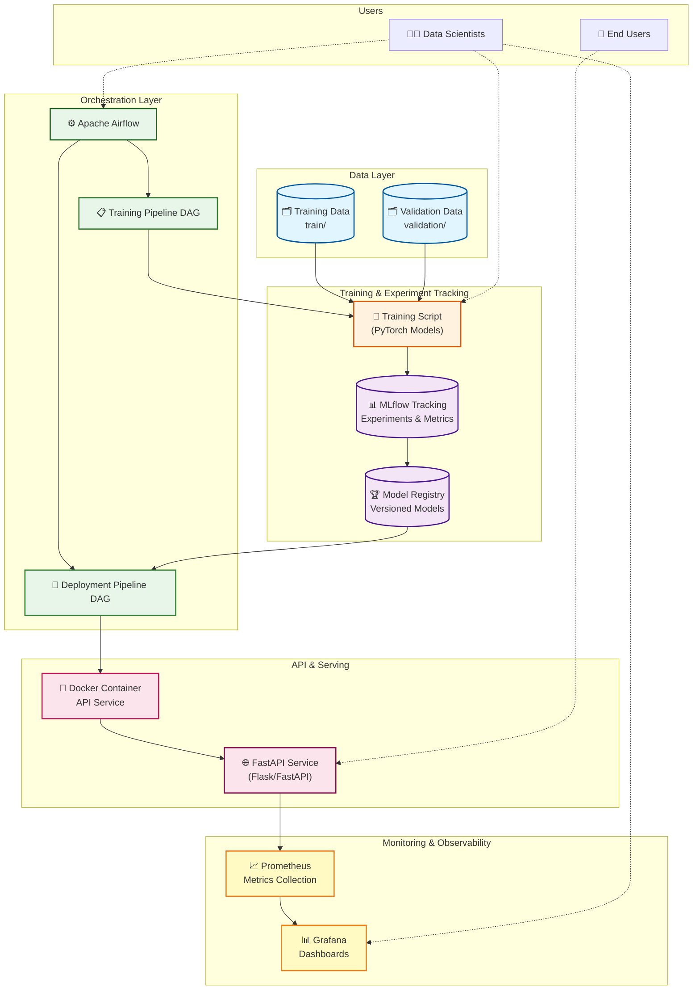

# 🏗️ Rice Leaf Disease Classification - System Architecture

## 📊 Overall System Architecture

---

## 🔄 Complete MLOps Workflow (Training → Deployment → Monitoring)

```mermaid
flowchart TD
    subgraph "1️⃣ Data Preparation"
        S1["📥 Load Dataset<br/>(train/ & validation/)"] --> S2["🔄 Data Augmentation<br/>(Transforms, Resize)"]
        S2 --> S3["✅ Data Validation"]
    end

    subgraph "2️⃣ Model Training"
        T1["🎯 Model Selection<br/>(EfficientNet/MobileNet)"] --> T2["🏋️ Training Loop<br/>(Epochs & Batches)"]
        T2 --> T3["📊 Validation"]
        T3 --> T4{"🛑 Early Stop?"}
        T4 -->|No| T2
        T4 -->|Yes| T5["💾 Save Best Model"]
    end

    subgraph "3️⃣ Experiment Tracking"
        E1["📈 Log Metrics<br/>(Accuracy, Loss, F1)"] --> E2["🏷️ Log Parameters<br/>(LR, Batch Size, etc)"]
        E2 --> E3["💾 Save Model Artifacts"]
        E3 --> E4["🔍 Compare Models"]
    end

    subgraph "4️⃣ Model Registry"
        R1{"🏆 Best Model?"} -->|Yes| R2["📝 Register Model<br/>(MLflow Registry)"]
        R1 -->|No| R3["⏭️ Skip"]
        R2 --> R4["🏷️ Tag: Production"]
    end

    subgraph "5️⃣ CI/CD Pipeline"
        CI1["🔍 Code Quality<br/>(Linting, Tests)"] --> CI2["🏗️ Build Docker<br/>(API + Model)"]
        CI2 --> CI3["✅ Unit Tests"]
        CI3 --> CI4{"✅ Pass?"}
        CI4 -->|No| CI5["❌ Fail Build"]
        CI4 -->|Yes| CI6["📦 Push to Registry"]
    end

    subgraph "6️⃣ Deployment"
        D1["🎭 Deploy Staging"] --> D2["💓 Health Check"]
        D2 --> D3{"✅ Healthy?"}
        D3 -->|No| D4["⏮️ Rollback"]
        D3 -->|Yes| D5["⚡ Load Test"]
        D5 --> D6{"✅ Performance OK?"}
        D6 -->|No| D4
        D6 -->|Yes| D7["👤 Manual Approval"]
        D7 -->|Approved| D8["🌟 Deploy Production"]
        D7 -->|Rejected| D4
    end

    subgraph "7️⃣ Monitoring"
        M1["📊 Collect Metrics<br/>(Prometheus)"] --> M2["📈 Visualize<br/>(Grafana Dashboard)"]
        M2 --> M3["🔔 Alert Setup"]
        M3 --> M4{"⚠️ Issue Detected?"}
        M4 -->|Yes| M5["📧 Notify Team"]
        M4 -->|No| M6["✅ System Healthy"]
    end

    subgraph "8️⃣ Feedback Loop"
        F1["📊 Monitor Performance"] --> F2["🔍 Analyze Errors"]
        F2 --> F3{"🤔 Retrain Needed?"}
        F3 -->|Yes| F4["🔄 Trigger Training"]
        F3 -->|No| F5["✅ Continue Monitoring"]
    end

    S3 --> T1
    T5 --> E1
    E4 --> R1
    R4 --> CI1
    CI6 --> D1
    D8 --> M1
    M6 --> F1
    F4 --> S1

    style S1 fill:#e3f2fd,stroke:#1565c0,stroke-width:2px
    style S2 fill:#e3f2fd,stroke:#1976d2,stroke-width:2px
    style S3 fill:#bbdefb,stroke:#1e88e5,stroke-width:2px

    style T1 fill:#fff3e0,stroke:#e65100,stroke-width:2px
    style T2 fill:#ffe0b2,stroke:#ef6c00,stroke-width:2px
    style T3 fill:#ffcc80,stroke:#f57c00,stroke-width:2px
    style T4 fill:#ffb74d,stroke:#fb8c00,stroke-width:2px
    style T5 fill:#ffa726,stroke:#ff9800,stroke-width:2px

    style E1 fill:#f3e5f5,stroke:#6a1b9a,stroke-width:2px
    style E2 fill:#e1bee7,stroke:#7b1fa2,stroke-width:2px
    style E3 fill:#ce93d8,stroke:#8e24aa,stroke-width:2px
    style E4 fill:#ba68c8,stroke:#9c27b0,stroke-width:2px

    style R1 fill:#fff9c4,stroke:#f57f17,stroke-width:2px
    style R2 fill:#fff59d,stroke:#f9a825,stroke-width:2px
    style R3 fill:#9e9e9e,stroke:#424242,stroke-width:2px
    style R4 fill:#ffeb3b,stroke:#fbc02d,stroke-width:2px

    style CI1 fill:#e0f2f1,stroke:#00695c,stroke-width:2px
    style CI2 fill:#b2dfdb,stroke:#00796b,stroke-width:2px
    style CI3 fill:#80cbc4,stroke:#00897b,stroke-width:2px
    style CI4 fill:#4db6ac,stroke:#009688,stroke-width:2px
    style CI5 fill:#f44336,stroke:#c62828,stroke-width:2px,color:#fff
    style CI6 fill:#26a69a,stroke:#00897b,stroke-width:2px,color:#fff

    style D1 fill:#c5cae9,stroke:#3949ab,stroke-width:2px
    style D2 fill:#9fa8da,stroke:#3f51b5,stroke-width:2px
    style D3 fill:#7986cb,stroke:#5c6bc0,stroke-width:2px
    style D4 fill:#f44336,stroke:#d32f2f,stroke-width:2px,color:#fff
    style D5 fill:#5c6bc0,stroke:#3f51b5,stroke-width:2px,color:#fff
    style D6 fill:#7986cb,stroke:#5c6bc0,stroke-width:2px
    style D7 fill:#ffa726,stroke:#f57c00,stroke-width:2px
    style D8 fill:#66bb6a,stroke:#388e3c,stroke-width:3px,color:#fff

    style M1 fill:#ffccbc,stroke:#d84315,stroke-width:2px
    style M2 fill:#ffab91,stroke:#e64a19,stroke-width:2px
    style M3 fill:#ff8a65,stroke:#f4511e,stroke-width:2px
    style M4 fill:#ff7043,stroke:#ff5722,stroke-width:2px
    style M5 fill:#ff5252,stroke:#d32f2f,stroke-width:2px,color:#fff
    style M6 fill:#81c784,stroke:#388e3c,stroke-width:2px,color:#fff

    style F1 fill:#dcedc8,stroke:#689f38,stroke-width:2px
    style F2 fill:#c5e1a5,stroke:#7cb342,stroke-width:2px
    style F3 fill:#aed581,stroke:#8bc34a,stroke-width:2px
    style F4 fill:#9ccc65,stroke:#7cb342,stroke-width:2px
    style F5 fill:#8bc34a,stroke:#689f38,stroke-width:2px,color:#fff
```

---

## 🔑 Key Technologies

| Component | Technology | Purpose |
|-----------|-----------|---------|
| **ML Framework** | PyTorch | Model training & inference |
| **Models** | EfficientNet-B0, MobileNetV3 | Image classification (6 classes) |
| **Orchestration** | Apache Airflow | Pipeline automation |
| **Experiment Tracking** | MLflow | Model versioning & metrics |
| **API** | Flask/FastAPI | REST API for predictions |
| **Containerization** | Docker & Docker Compose | Service isolation & deployment |
| **Monitoring** | Prometheus + Grafana | System & model monitoring |
| **CI/CD** | Airflow DAGs | Automated training & deployment |

## 🎯 Disease Classes
1. 🦠 Bacterial Leaf Blight
2. 🟤 Brown Spot
3. ✅ Healthy
4. 💥 Leaf Blast
5. 🌊 Leaf Scald
6. 🪵 Narrow Brown Spot
